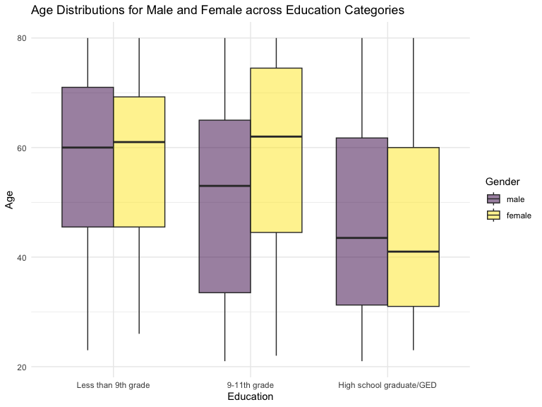
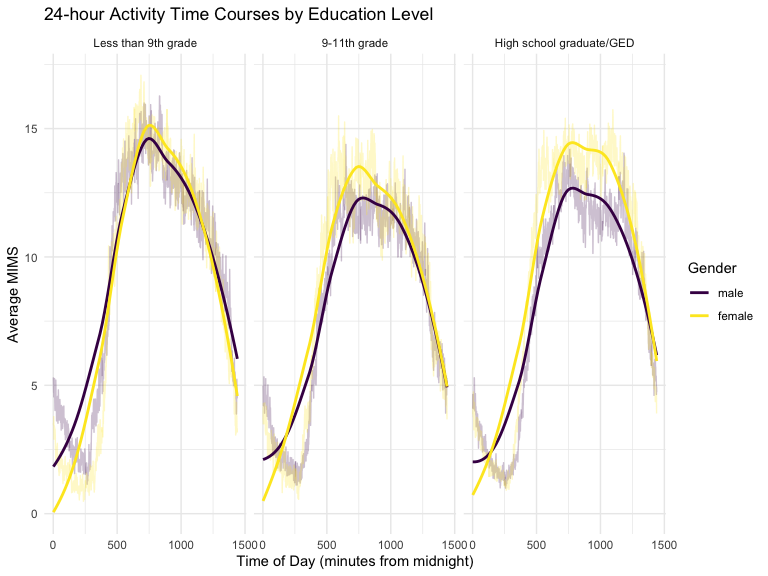
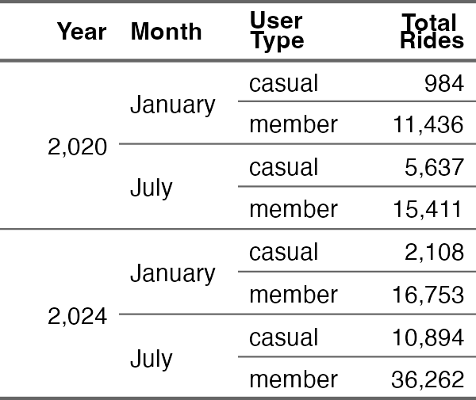
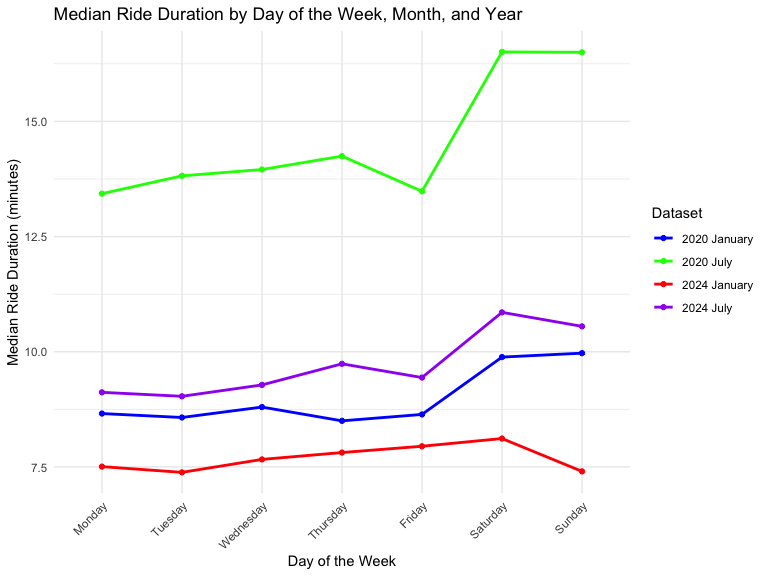
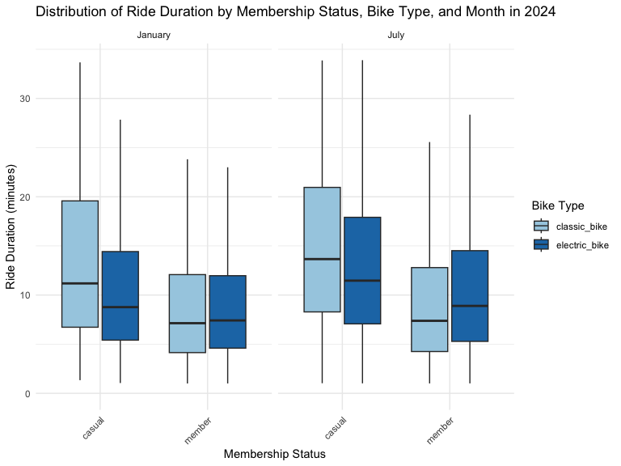

p8105_hw3_kw3104
================
Carrie Wu
Oct 16, 2024

### Problem 1

#### Read in the data

``` r
data("ny_noaa")
```

#### Answer questions about the data

This dataset contains 2595176 rows and 7 columns. Variables include
weather station id, date of observation, (tenths of mm), snowfall (mm),
snow depth (mm), and min and max temperature (tenths of degrees C).

Below we clean the data, creating separate variables for year, month,
and day and converting `tmax` and `tmin` to numeric. We find that 0 is
the most commonly observed value for snowfall. This is because most days
of the year, it does not snow at all in NY. The second most commonly
observed value is `NA`, indicating missingness. Other common values are
13, 25, and 51, suggesting that snowfall is originally recorded in
fractions of an inch and converted to mm.

``` r
ny_noaa %>% 
  count(snow) %>%
  arrange(desc(n))
```

    ## # A tibble: 282 × 2
    ##     snow       n
    ##    <int>   <int>
    ##  1     0 2008508
    ##  2    NA  381221
    ##  3    25   31022
    ##  4    13   23095
    ##  5    51   18274
    ##  6    76   10173
    ##  7     8    9962
    ##  8     5    9748
    ##  9    38    9197
    ## 10     3    8790
    ## # ℹ 272 more rows

``` r
ny_noaa = 
  ny_noaa %>% 
  separate(date, into = c("year", "month", "day"), convert = TRUE) %>% 
  mutate(
    tmax = as.numeric(tmax),
    tmin = as.numeric(tmin))
```

Below is a two-panel plot showing the average max temperature in January
and in July in each station across years. As expected, the mean
temperature in January is much lower than the mean temperature in July
for all stations and across all years. All stations appear to follow
similar trends of temperature peaks and valleys within a month across
the years, i.e. when one station has a high monthly mean temperature for
a given year, most other stations also have a high monthly mean
temperature for that year. We do see one uncharacteristically cold
station in July of 1987 or 1988, as well as a few other less drastic
outliers.

``` r
ny_noaa %>% 
  group_by(id, year, month) %>% 
  filter(month %in% c(1, 7)) %>% 
  summarize(mean_tmax = mean(tmax, na.rm = TRUE, color = id)) %>% 
  ggplot(aes(x = year, y = mean_tmax, group = id)) + geom_point() + geom_path() +
  facet_grid(~month) +
  labs(title = "Mean monthly temperature for each station across years for January and July")
```

    ## `summarise()` has grouped output by 'id', 'year'. You can override using the
    ## `.groups` argument.


Below we show a two-panel plot including (i) a hex plot of `tmax` vs
`tmin` for the full dataset; and (ii) a ridge plot showing the
distribution of snowfall values (in mm) greater than 0 and less than 100
separately by year.

From the hex plot we see that while there is some variability, the
majority of the data cluster tightly in the center of the distribution.
In relatively rare cases, it seems that `tmax` is less than `tmin`,
which raises questions about data recording and quality.

From the ridge plot, we see a multimodal density of snowfall within a
given year. Most stations see between 0 and 35 mm of snow in a year.
Then there is a another group of stations that see about 45 mm of snow,
and another group that sees nearly 80 mm. It is likely this
multimodality stems from the conversion of measurements in one system
(fractions of an inch) to another (using the metric system), which was
also noted in the table of common values.

``` r
hex = 
  ny_noaa %>% 
  ggplot(aes(x = tmin, y = tmax)) + 
  geom_hex()

ridge = 
  ny_noaa %>% 
  filter(snow < 100, snow > 0) %>%
  ggplot(aes(x = snow, y = as.factor(year))) + 
  geom_density_ridges()

hex + ridge
```

    ## Picking joint bandwidth of 3.76


## Problem 2

Load, tidy and merge data sets:

``` r
##load demography csv file, skip first 4 rows that contain non-related information, clean names.
## before sort, `demo` has 250 observations and 5 variables; after sort, `demo` has 228 observations and 5 variables.
demo = 
  read_csv("data/nhanes_covar.csv", skip = 4) |>
  janitor::clean_names() |>
  filter(age >=21) |>
  drop_na()
```

    ## Rows: 250 Columns: 5
    ## ── Column specification ────────────────────────────────────────────────────────
    ## Delimiter: ","
    ## dbl (5): SEQN, sex, age, BMI, education
    ## 
    ## ℹ Use `spec()` to retrieve the full column specification for this data.
    ## ℹ Specify the column types or set `show_col_types = FALSE` to quiet this message.

``` r
## load accelerometer csv file, clean names.
## `accel` has 250 observations and 1441 variables.
accel = 
  read_csv("data/nhanes_accel.csv") |>
  rename(seqn = SEQN) 
```

    ## Rows: 250 Columns: 1441
    ## ── Column specification ────────────────────────────────────────────────────────
    ## Delimiter: ","
    ## dbl (1441): SEQN, min1, min2, min3, min4, min5, min6, min7, min8, min9, min1...
    ## 
    ## ℹ Use `spec()` to retrieve the full column specification for this data.
    ## ℹ Specify the column types or set `show_col_types = FALSE` to quiet this message.

``` r
## Use anti_join to check for completeness and correctness across datasets. `anti` shows 0 observation and 5 variables, means the all rows are matched.
anti = anti_join(demo, accel, by = "seqn")


## left join `demo` and `accel` files, combine them into `demo_accel` file based on seqn. `demo_accel` has 228 observations and 1445 variables
demo_accel = left_join (demo, accel, by = "seqn")
```

Table for the number of men and women in each education category

``` r
## mutate `sex` and `education` from numerical variables into factor
sex_edu <- demo_accel|>
  mutate(
    sex = factor(sex, levels = c(1, 2), labels = c("male", "female")),
    education = factor(education, levels = c(1, 2, 3, 4, 5), 
                       labels = c("Less than 9th grade", 
                                  "9-11th grade", 
                                  "High school graduate/GED", 
                                  "Some college/AA degree", 
                                  "College graduate or above")))


## count the number of male and female, change from long format into wide format using `pivot_wider`.
education_gender_table <- sex_edu |>
  group_by(sex, education) |>
  summarize(count = n(), .groups = "drop") |>
  pivot_wider(names_from = education, values_from = count)

## make a table
kable(education_gender_table, caption = "Number of Male and Female in Each Education Category")
```

| sex    | Less than 9th grade | 9-11th grade | High school graduate/GED |
|:-------|--------------------:|-------------:|-------------------------:|
| male   |                  27 |           35 |                       56 |
| female |                  28 |           23 |                       59 |

Number of Male and Female in Each Education Category

- Education level for male: 27 less than 9th grade, 35 9-11th grade, 56
  high school graduate/GED
- Education level for female: 28 less than 9th grade, 23 9-11th grade,
  59 high school graduate/GED

Visualization of the age distributions for men and women in each
education category.

``` r
## set x- axis education and y-axis as age and make a box plot. 
## box plot shows the median to better compare between male and female
sex_edu |>
ggplot(aes(x = education, y = age, fill = sex)) + 
  geom_boxplot(alpha = 0.5, position = position_dodge(width = 0.75)) +
  labs(
    title = "Age Distributions for Male and Female across Education Categories",
    x = "Education",
    y = "Age",
    fill = "Gender") +
  scale_fill_viridis_d() +
  theme_minimal()
```



- Male generally have higher median ages in “Less than 9th grade” and
  “High school graduate/GED”
- Female have higher median ages in “9-11th grade”.

Aggregate and plot the total activity by age, comparing men and women
across education levels

``` r
## organize the data
total_activity <- sex_edu |>
  group_by(age, sex, education) |>
  summarize(total_activity = sum(age, sex, education, na.rm = TRUE))
```

    ## `summarise()` has grouped output by 'age', 'sex'. You can override using the
    ## `.groups` argument.

``` r
## make a plot the total activity by age, comparing men and women across education levels
ggplot(total_activity, aes(x = age, y = total_activity, color = sex)) +
  geom_point(alpha = 0.5) + 
  geom_smooth(se = FALSE, method = "loess") +  # Trend line for smooth visualization
  facet_wrap(~ education) + # generate 3 plots by education
  labs(
    title = "Total Daily Activity by Age, Gender, and Education Level",
    x = "Age",
    y = "Total Activity",
    color = "Gender") +
   scale_color_viridis_d() +
  theme_minimal()
```

    ## `geom_smooth()` using formula = 'y ~ x'


- Total activity for both men and women increases with age across all
  education levels, with a notable rise starting around age 50. In the
  “Less than 9th grade” and “9-11th grade” categories, men tend to have
  higher activity levels than women. For “High school graduate/GED,”
  women show more variability in total activity compared to men,
  possibly due to lifestyle differences.

Make a three-panel plot that shows the 24-hour activity time courses for
each education level and use color to indicate sex.

``` r
## select columns that start with "min"
activity_data <- demo_accel |>
  select(sex, education, starts_with("min")) |>
  pivot_longer(cols = starts_with("min"), 
               names_to = "time", 
               values_to = "MIMS") |>
  mutate(time = as.numeric(gsub("min", "", time))) |> # Convert 'min' from dbl to numerical 
  drop_na(MIMS)

# Calculate mean MIMS per time, sex, and education
activity_summary <- activity_data |>
  group_by(time, sex, education) |>
  summarize(mean_MIMS = mean(MIMS, na.rm = TRUE), .groups = "drop") |>
  mutate(sex = factor(sex, labels = c("male", "female"))) 

## Plot 24-hour activity time courses by education level with color for sex
education_labels <- c("1" = "Less than 9th grade", 
                      "2" = "9-11th grade", 
                      "3" = "High school graduate/GED")

ggplot(activity_summary, aes(x = time, y = mean_MIMS, color = sex, group = sex)) +
  geom_line(alpha = 0.25) +
  geom_smooth(se = FALSE, method = "loess") +
  facet_wrap(~ education, labeller = labeller(education = education_labels)) +
  labs(
    title = "24-hour Activity Time Courses by Education Level",
    x = "Time of Day (minutes from midnight)",
    y = "Average MIMS",
    color = "Gender") +
  theme_minimal()
```

    ## `geom_smooth()` using formula = 'y ~ x'


\* Overall, across the three education levels, both males and females
exhibit a similar trend: average activity is relatively low in the
morning and evening, peaks mid-day, and then declines in the afternoon.
In each plot, females consistently show higher average activity than
males. Specifically, in the “High school graduate/GED” group, the peak
activity period is broader than in the other two groups, suggesting that
individuals with this education level sustain higher activity for a
longer duration

## Problem 3

load, clean and tidy csv files:

``` r
Jan20 = 
  read_csv("data/Jan 2020 Citi.csv") |>
  janitor::clean_names() |>
  mutate(year = 2020, month = "January")
```

    ## Rows: 12420 Columns: 7
    ## ── Column specification ────────────────────────────────────────────────────────
    ## Delimiter: ","
    ## chr (6): ride_id, rideable_type, weekdays, start_station_name, end_station_n...
    ## dbl (1): duration
    ## 
    ## ℹ Use `spec()` to retrieve the full column specification for this data.
    ## ℹ Specify the column types or set `show_col_types = FALSE` to quiet this message.

``` r
Jan24 = 
  read_csv("./data/Jan 2024 Citi.csv") |>
  janitor::clean_names() |>
  mutate(year = 2024, month = "January")
```

    ## Rows: 18861 Columns: 7
    ## ── Column specification ────────────────────────────────────────────────────────
    ## Delimiter: ","
    ## chr (6): ride_id, rideable_type, weekdays, start_station_name, end_station_n...
    ## dbl (1): duration
    ## 
    ## ℹ Use `spec()` to retrieve the full column specification for this data.
    ## ℹ Specify the column types or set `show_col_types = FALSE` to quiet this message.

``` r
Jul20 = 
  read_csv("data/July 2020 Citi.csv") |>
  janitor::clean_names() |>
  mutate(year = 2020, month = "July")
```

    ## Rows: 21048 Columns: 7
    ## ── Column specification ────────────────────────────────────────────────────────
    ## Delimiter: ","
    ## chr (6): ride_id, rideable_type, weekdays, start_station_name, end_station_n...
    ## dbl (1): duration
    ## 
    ## ℹ Use `spec()` to retrieve the full column specification for this data.
    ## ℹ Specify the column types or set `show_col_types = FALSE` to quiet this message.

``` r
Jul24 = 
  read_csv("data/July 2024 Citi.csv") |>
  janitor::clean_names() |>
  mutate(year = 2024, month = "July")
```

    ## Rows: 47156 Columns: 7
    ## ── Column specification ────────────────────────────────────────────────────────
    ## Delimiter: ","
    ## chr (6): ride_id, rideable_type, weekdays, start_station_name, end_station_n...
    ## dbl (1): duration
    ## 
    ## ℹ Use `spec()` to retrieve the full column specification for this data.
    ## ℹ Specify the column types or set `show_col_types = FALSE` to quiet this message.

``` r
combined<- bind_rows(Jan20, Jan24, Jul20, Jul24)  
```

- 4 csv files have same 7 variables (ride_id, rideable_type, weekdays,
  duration, start_station_name, end_station_name and member_causal), I
  added two columns for year and month at the end of each csv file, so
  they have 9 variables.
- Before combine, `Jan20` has 12420 observations, `Jan24` has 18861
  observations, `Jul20` has 21048 observations, and `Jul24` has 47156
  observations. After combined, `combined` has 99485 observations.

Produce a reader-friendly table showing the total number of rides in
each combination of year and month separating casual riders and Citi
Bike members.

``` r
# Process the data to create ride_summary
ride_summary <- combined |>
  group_by(year, month, member_casual) |>
  summarize(total_rides = n(), .groups = 'drop') |>
  rename(
    "Year" = year,
    "Month" = month,
    "User Type" = member_casual,
    "Total Rides" = total_rides) |>
  arrange(Year, Month)

# Create the flextable and format only Total Rides with commas
ride_summary_ft <- flextable(ride_summary) |>
  merge_v(j = c("Year", "Month")) |>  # Merge cells vertically in Year and Month columns
  colformat_int(j = "Total Rides", big.mark = ",") |>  # Format only Total Rides with commas
  set_header_labels(
    Year = "Year",
    Month = "Month",
    `User Type` = "User Type",
    `Total Rides` = "Total Rides"
  ) |>
  theme_vanilla()  # Apply a clean theme

# Display the flextable
ride_summary_ft
```



- There are 8 observations (2020 January casual, 2020 January member,
  2020 July causual, 2020 July member, 2024 January casual, 2024 January
  member, 2024 July causual, 2024 July member) and 4 variables (year,
  month, user type, total rides) in the `ride_summary`. For more easy to
  read, I merged same values cells using `flextable`.

- July 2024 CITI bike member has the most total rides (36262), January
  2020 casual member has the least total rides (984).

Make a table showing the 5 most popular starting stations for July 2024;
include the number of rides originating from these stations.

``` r
top_station_Jul24 <- Jul24 |>
  group_by(start_station_name) |>
  summarize(total_rides = n()) |>
  arrange(desc(total_rides)) |>
  slice_head(n = 5)

top_station_Jul24 |>
  kable(
    col.names = c("Starting Station", "Total Rides"),
    caption = "Top 5 Starting Stations for July 2024")
```

| Starting Station         | Total Rides |
|:-------------------------|------------:|
| Pier 61 at Chelsea Piers |         163 |
| University Pl & E 14 St  |         155 |
| W 21 St & 6 Ave          |         152 |
| West St & Chambers St    |         150 |
| W 31 St & 7 Ave          |         146 |

Top 5 Starting Stations for July 2024

- In July 2024, the most popular station is `Pier 61 at Chelsea Piers`
  with 163 total rides; the second popular station is
  `University Pl & E 14 St` with 155 total rides; the third popular
  station is `W 21 St & 6 Ave` with 152 total rides; the fourth popular
  station is `West St & Chambers St` with 150 total rides; the fifth
  popular station is `W 31 St & 7 Ave` with 146 total rides.

Make a plot to investigate the effects of day of the week, month, and
year on median ride duration. This plot can include one or more panels,
but should facilitate comparison across all variables of interest.

``` r
# Calculate median ride duration by weekday, month, and year
median_duration <- combined |>
  group_by(year, month, weekdays) |>
  summarize(median_duration = median(duration, na.rm = TRUE), .groups = 'drop') |>
  mutate(
    weekdays = fct_relevel(weekdays, c("Monday", "Tuesday", "Wednesday", "Thursday", "Friday", "Saturday", "Sunday")),
    dataset = paste(year, month)  # Create 'dataset' combining year and month
  )

# Define colors for each dataset (year and month combination)
colors <- c("2020 January" = "blue", "2024 January" = "red", "2020 July" = "green", "2024 July" = "purple")

# Plot using ggplot
ggplot(median_duration, aes(x = weekdays, y = median_duration, group = dataset, color = dataset)) +
  geom_line(linewidth = 1) +
  geom_point(linewidth = 3) +
  labs(
    title = "Median Ride Duration by Day of the Week, Month, and Year",
    x = "Day of the Week",
    y = "Median Ride Duration (minutes)",
    color = "Dataset") +
  scale_color_manual(values = colors) +
  theme_minimal() +
  theme(
    axis.text.x = element_text(angle = 45, hjust = 1),
    legend.position = "right")
```


\* `median_duration` has 28 observations and 5 variables (year, month,
weekdays, median_duration and dataset. \* Comparing to other time
points, July 2020 has significant higher median ride duration that all
higher than 12.5. Othe time points are relatively close, with median
ride duration between 7.3 and 10.8. \* The highest median ride duration
is July 2020 Sunday 16.507567; the lowest median ride duration is
Janurary 2024 7.382083.

There were relatively few electric Citi Bikes in 2020, but many more are
available now. For data in 2024, make a figure that shows the impact of
month, membership status, and bike type on the distribution of ride
duration.

``` r
# Filter data for the year 2024
data_2024 <- combined |>
  filter(year == 2024) |>
  select(month, member_casual, rideable_type, duration) 

# Create the plot with ggplot2
ggplot(data_2024, aes(x = member_casual, y = duration, fill = rideable_type)) +
  geom_boxplot(outlier.shape = NA) +  # Use boxplot to show distribution, remove outliers from the plot
  facet_wrap(~ month) +  # Create separate panels for each month
  labs(
    title = "Distribution of Ride Duration by Membership Status, Bike Type, and Month in 2024",
    x = "Membership Status",
    y = "Ride Duration (minutes)",
    fill = "Bike Type"
  ) +
  scale_y_continuous(limits = c(0, quantile(data_2024$duration, 0.95, na.rm = TRUE))) +  # Limit y-axis to the 95th percentile
  scale_fill_brewer(palette = "Paired") +  # Apply color palette for bike types
  theme_minimal() +
  theme(
    axis.text.x = element_text(angle = 45, hjust = 1),
    legend.position = "right")
```


\* `data_2024` has 66017 observation and 4 variables (month,
member_casual, rideable_type, duration). \* For both January and July,
casual riders tend to have longer ride durations than members across
both bike types. \* July has slightly longer duration compares to
January, suggest that people more likely perform outdoor recreation in
warm weather.
