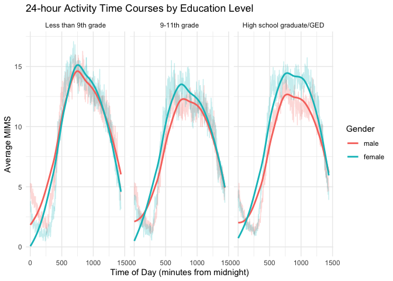

p8105_hw3_kw3104
================

``` r
library(tidyverse)
```

    ## ── Attaching core tidyverse packages ──────────────────────── tidyverse 2.0.0 ──
    ## ✔ dplyr     1.1.4     ✔ readr     2.1.5
    ## ✔ forcats   1.0.0     ✔ stringr   1.5.1
    ## ✔ ggplot2   3.5.1     ✔ tibble    3.2.1
    ## ✔ lubridate 1.9.3     ✔ tidyr     1.3.1
    ## ✔ purrr     1.0.2     
    ## ── Conflicts ────────────────────────────────────────── tidyverse_conflicts() ──
    ## ✖ dplyr::filter() masks stats::filter()
    ## ✖ dplyr::lag()    masks stats::lag()
    ## ℹ Use the conflicted package (<http://conflicted.r-lib.org/>) to force all conflicts to become errors

``` r
library(dplyr)
library(knitr)
library(ggplot2)
library(flextable) 
```

    ## 
    ## Attaching package: 'flextable'
    ## 
    ## The following object is masked from 'package:purrr':
    ## 
    ##     compose

## Problem 2

Load, tidy and merge data sets:

``` r
##load demography csv file, skip first 4 rows that contain non-related information, clean names.
## before sort, `demo` has 250 observations and 5 variables; after sort, `demo` has 228 observations and 5 variables.
demo = 
  read_csv("data/nhanes_covar.csv", skip = 4) |>
  janitor::clean_names() |>
  filter(age >=21) |>
  drop_na()
```

    ## Rows: 250 Columns: 5
    ## ── Column specification ────────────────────────────────────────────────────────
    ## Delimiter: ","
    ## dbl (5): SEQN, sex, age, BMI, education
    ## 
    ## ℹ Use `spec()` to retrieve the full column specification for this data.
    ## ℹ Specify the column types or set `show_col_types = FALSE` to quiet this message.

``` r
## load accelerometer csv file, clean names.
## `accel` has 250 observations and 1441 variables.
accel = 
  read_csv("data/nhanes_accel.csv") |>
  rename(seqn = SEQN) 
```

    ## Rows: 250 Columns: 1441
    ## ── Column specification ────────────────────────────────────────────────────────
    ## Delimiter: ","
    ## dbl (1441): SEQN, min1, min2, min3, min4, min5, min6, min7, min8, min9, min1...
    ## 
    ## ℹ Use `spec()` to retrieve the full column specification for this data.
    ## ℹ Specify the column types or set `show_col_types = FALSE` to quiet this message.

``` r
## Use anti_join to check for completeness and correctness across datasets. `anti` shows 0 observation and 5 variables, means the all rows are matched.
anti = anti_join(demo, accel, by = "seqn")


## left join `demo` and `accel` files, combine them into `demo_accel` file based on seqn. `demo_accel` has 228 observations and 1445 variables
demo_accel = left_join (demo, accel, by = "seqn")
```

Table for the number of men and women in each education category

``` r
## mutate `sex` and `education` from numerical variables into factor
sex_edu <- demo_accel|>
  mutate(
    sex = factor(sex, levels = c(1, 2), labels = c("male", "female")),
    education = factor(education, levels = c(1, 2, 3, 4, 5), 
                       labels = c("Less than 9th grade", 
                                  "9-11th grade", 
                                  "High school graduate/GED", 
                                  "Some college/AA degree", 
                                  "College graduate or above")))


## count the number of male and female, change from long format into wide format using `pivot_wider`.
education_gender_table <- sex_edu |>
  group_by(sex, education) |>
  summarize(count = n(), .groups = "drop") |>
  pivot_wider(names_from = education, values_from = count)

## make a table
kable(education_gender_table, caption = "Number of Male and Female in Each Education Category")
```

| sex    | Less than 9th grade | 9-11th grade | High school graduate/GED |
|:-------|--------------------:|-------------:|-------------------------:|
| male   |                  27 |           35 |                       56 |
| female |                  28 |           23 |                       59 |

Number of Male and Female in Each Education Category

- Education level for male: 27 less than 9th grade, 35 9-11th grade, 56
  high school graduate/GED
- Education level for female: 28 less than 9th grade, 23 9-11th grade,
  59 high school graduate/GED

Visualization of the age distributions for men and women in each
education category.

``` r
## set x- axis education and y-axis as age and make a box plot. 
## box plot shows the median to better compare between male and female
sex_edu |>
ggplot(aes(x = education, y = age, fill = sex)) + 
  geom_boxplot(alpha = 0.5, position = position_dodge(width = 0.75)) +
  labs(
    title = "Age Distributions for Male and Female across Education Categories",
    x = "Education",
    y = "Age",
    fill = "Gender") +
  scale_fill_viridis_d() +
  theme_minimal()
```

<!-- -->

- Male generally have higher median ages in “Less than 9th grade” and
  “High school graduate/GED”
- Female have higher median ages in “9-11th grade”.

Aggregate and plot the total activity by age, comparing men and women
across education levels

``` r
## organize the data
total_activity <- sex_edu |>
  group_by(age, sex, education) |>
  summarize(total_activity = sum(age, sex, education, na.rm = TRUE))
```

    ## `summarise()` has grouped output by 'age', 'sex'. You can override using the
    ## `.groups` argument.

``` r
## make a plot the total activity by age, comparing men and women across education levels
ggplot(total_activity, aes(x = age, y = total_activity, color = sex)) +
  geom_point(alpha = 0.5) + 
  geom_smooth(se = FALSE, method = "loess") +  # Trend line for smooth visualization
  facet_wrap(~ education) + # generate 3 plots by education
  labs(
    title = "Total Daily Activity by Age, Gender, and Education Level",
    x = "Age",
    y = "Total Activity",
    color = "Gender") +
   scale_color_viridis_d() +
  theme_minimal()
```

    ## `geom_smooth()` using formula = 'y ~ x'

<!-- -->

- Total activity for both men and women increases with age across all
  education levels, with a notable rise starting around age 50. In the
  “Less than 9th grade” and “9-11th grade” categories, men tend to have
  higher activity levels than women. For “High school graduate/GED,”
  women show more variability in total activity compared to men,
  possibly due to lifestyle differences.

Make a three-panel plot that shows the 24-hour activity time courses for
each education level and use color to indicate sex.

``` r
## select columns that start with "min"
activity_data <- demo_accel |>
  select(sex, education, starts_with("min")) |>
  pivot_longer(cols = starts_with("min"), 
               names_to = "time", 
               values_to = "MIMS") |>
  mutate(time = as.numeric(gsub("min", "", time))) |> # Convert 'min' from dbl to numerical 
  drop_na(MIMS)

# Calculate mean MIMS per time, sex, and education
activity_summary <- activity_data |>
  group_by(time, sex, education) |>
  summarize(mean_MIMS = mean(MIMS, na.rm = TRUE), .groups = "drop") |>
  mutate(sex = factor(sex, labels = c("male", "female"))) 

## Plot 24-hour activity time courses by education level with color for sex
education_labels <- c("1" = "Less than 9th grade", 
                      "2" = "9-11th grade", 
                      "3" = "High school graduate/GED")

ggplot(activity_summary, aes(x = time, y = mean_MIMS, color = sex, group = sex)) +
  geom_line(alpha = 0.25) +
  geom_smooth(se = FALSE, method = "loess") +
  facet_wrap(~ education, labeller = labeller(education = education_labels)) +
  labs(
    title = "24-hour Activity Time Courses by Education Level",
    x = "Time of Day (minutes from midnight)",
    y = "Average MIMS",
    color = "Gender") +
  theme_minimal()
```

    ## `geom_smooth()` using formula = 'y ~ x'

<!-- --> \*
Overall, across the three education levels, both males and females
exhibit a similar trend: average activity is relatively low in the
morning and evening, peaks mid-day, and then declines in the afternoon.
In each plot, females consistently show higher average activity than
males. Specifically, in the “High school graduate/GED” group, the peak
activity period is broader than in the other two groups, suggesting that
individuals with this education level sustain higher activity for a
longer duration

## Problem 3

load, clean and tidy csv files:

``` r
Jan20 = 
  read_csv("data/Jan 2020 Citi.csv") |>
  janitor::clean_names() |>
  mutate(year = 2020, month = "January")
```

    ## Rows: 12420 Columns: 7
    ## ── Column specification ────────────────────────────────────────────────────────
    ## Delimiter: ","
    ## chr (6): ride_id, rideable_type, weekdays, start_station_name, end_station_n...
    ## dbl (1): duration
    ## 
    ## ℹ Use `spec()` to retrieve the full column specification for this data.
    ## ℹ Specify the column types or set `show_col_types = FALSE` to quiet this message.

``` r
Jan24 = 
  read_csv("./data/Jan 2024 Citi.csv") |>
  janitor::clean_names() |>
  mutate(year = 2024, month = "January")
```

    ## Rows: 18861 Columns: 7
    ## ── Column specification ────────────────────────────────────────────────────────
    ## Delimiter: ","
    ## chr (6): ride_id, rideable_type, weekdays, start_station_name, end_station_n...
    ## dbl (1): duration
    ## 
    ## ℹ Use `spec()` to retrieve the full column specification for this data.
    ## ℹ Specify the column types or set `show_col_types = FALSE` to quiet this message.

``` r
Jul20 = 
  read_csv("data/July 2020 Citi.csv") |>
  janitor::clean_names() |>
  mutate(year = 2020, month = "July")
```

    ## Rows: 21048 Columns: 7
    ## ── Column specification ────────────────────────────────────────────────────────
    ## Delimiter: ","
    ## chr (6): ride_id, rideable_type, weekdays, start_station_name, end_station_n...
    ## dbl (1): duration
    ## 
    ## ℹ Use `spec()` to retrieve the full column specification for this data.
    ## ℹ Specify the column types or set `show_col_types = FALSE` to quiet this message.

``` r
Jul24 = 
  read_csv("data/July 2024 Citi.csv") |>
  janitor::clean_names() |>
  mutate(year = 2024, month = "July")
```

    ## Rows: 47156 Columns: 7
    ## ── Column specification ────────────────────────────────────────────────────────
    ## Delimiter: ","
    ## chr (6): ride_id, rideable_type, weekdays, start_station_name, end_station_n...
    ## dbl (1): duration
    ## 
    ## ℹ Use `spec()` to retrieve the full column specification for this data.
    ## ℹ Specify the column types or set `show_col_types = FALSE` to quiet this message.

``` r
combined<- bind_rows(Jan20, Jan24, Jul20, Jul24)  
```

- 4 csv files have same 7 variables (ride_id, rideable_type, weekdays,
  duration, start_station_name, end_station_name and member_causal), I
  added two columns for year and month at the end of each csv file, so
  they have 9 variables.
- Before combine, `Jan20` has 12420 observations, `Jan24` has 18861
  observations, `Jul20` has 21048 observations, and `Jul24` has 47156
  observations. After combined, `combined` has 99485 observations.

Produce a reader-friendly table showing the total number of rides in
each combination of year and month separating casual riders and Citi
Bike members.

``` r
# Process the data to create ride_summary
ride_summary <- combined |>
  group_by(year, month, member_casual) |>
  summarize(total_rides = n(), .groups = 'drop') |>
  rename(
    "Year" = year,
    "Month" = month,
    "User Type" = member_casual,
    "Total Rides" = total_rides) |>
  arrange(Year, Month)

# Create the flextable and format only Total Rides with commas
ride_summary_ft <- flextable(ride_summary) |>
  merge_v(j = c("Year", "Month")) |>  # Merge cells vertically in Year and Month columns
  colformat_int(j = "Total Rides", big.mark = ",") |>  # Format only Total Rides with commas
  set_header_labels(
    Year = "Year",
    Month = "Month",
    `User Type` = "User Type",
    `Total Rides` = "Total Rides"
  ) |>
  theme_vanilla()  # Apply a clean theme

# Display the flextable
ride_summary_ft
```


\* There are 8 observations (2020 January casual, 2020 January member,
2020 July causual, 2020 July member, 2024 January casual, 2024 January
member, 2024 July causual, 2024 July member) and 4 variables (year,
month, user type, total rides) in the `ride_summary`. For more easy to
read, I merged same values cells using `flextable`. \* July 2024 CITI
bike member has the most total rides (36262), January 2020 casual member
has the least total rides (984).

Make a table showing the 5 most popular starting stations for July 2024

``` r
top_station_Jul24 <- Jul24 |>
  group_by(start_station_name) |>
  summarize(total_rides = n()) |>
  arrange(desc(total_rides)) |>
  slice_head(n = 5)

top_station_Jul24 |>
  kable(
    col.names = c("Starting Station", "Total Rides"),
    caption = "Top 5 Starting Stations for July 2024")
```

| Starting Station         | Total Rides |
|:-------------------------|------------:|
| Pier 61 at Chelsea Piers |         163 |
| University Pl & E 14 St  |         155 |
| W 21 St & 6 Ave          |         152 |
| West St & Chambers St    |         150 |
| W 31 St & 7 Ave          |         146 |

Top 5 Starting Stations for July 2024

- In July 2024, the most popular station is `Pier 61 at Chelsea Piers`
  with 163 total rides; the second popular station is
  `University Pl & E 14 St` with 155 total rides; the third popular
  station is `W 21 St & 6 Ave` with 152 total rides; the fourth popular
  station is `West St & Chambers St` with 150 total rides; the fifth
  popular station is `W 31 St & 7 Ave` with 146 total rides.
